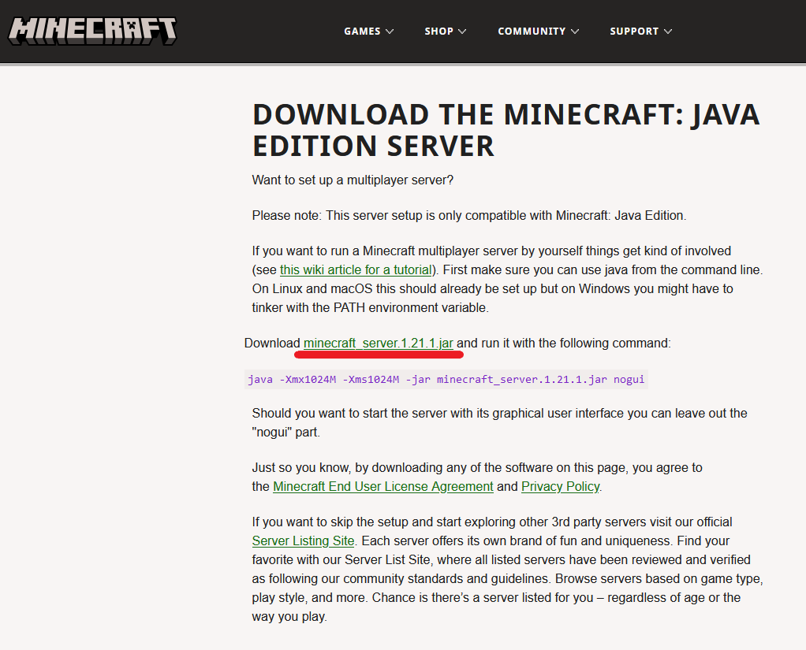

# How to install Minecraft server on Ubuntu 24.04
Minecraft is a sandbox video game developed and published by Mojang Studios. It was created by Markus “Notch” Persson and released as a public alpha for PC in 2009 before its official release in November 2011. The game has since become one of the best-selling video games of all time, with over 200 million copies sold across all platforms.
## How to install Minecraft server on Ubuntu 24.04
Before starting the installation you need to update the package lists using the command:
```
sudo apt update
```
Minecraft requires Java to run. Ubuntu 24.04 should have OpenJDK available. To install it run the command:
```
sudo apt install openjdk-21-jdk
```
Next, navigate to the home directory:
```
cd ~
```
Then create the directory for the future Minecraft server. For example, name it `minecraft`:
```
mkdir minecraft
```
And navigate the created directory:
```
cd minecraft
```
Next, get the download link for the latest version from the download page.



Continued on the [iolloi.icu](https://iolloi.icu/index.php/2024/08/24/how-to-install-minecraft-server-on-ubuntu/)
